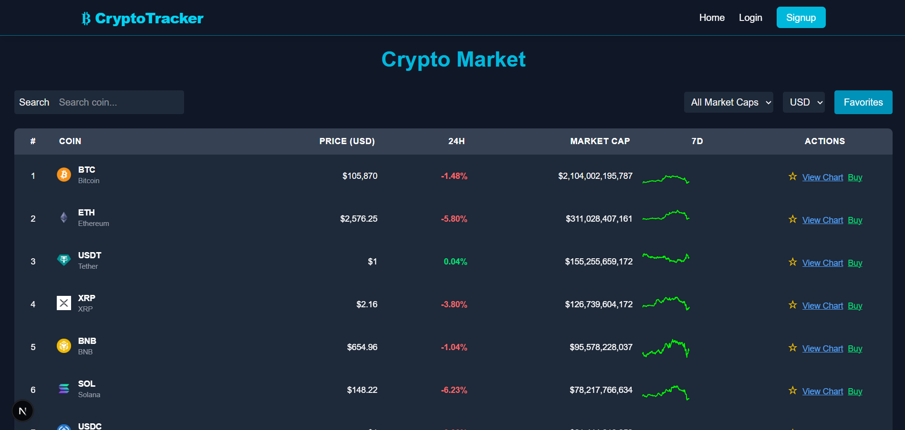
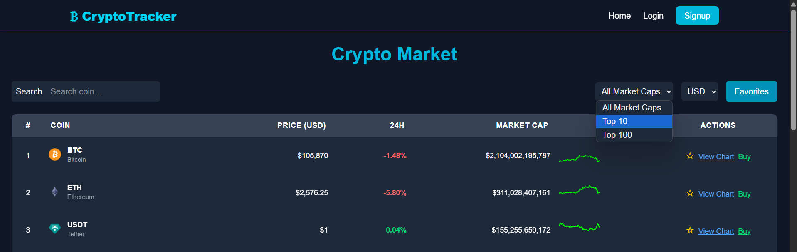
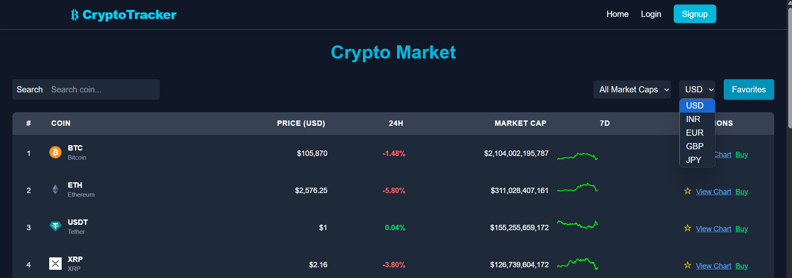

# 💰 Crypto Price Tracker

A fully responsive web application that allows users to **track real-time cryptocurrency prices**, **filter by market cap**, **switch currencies**, **save favorites**, and more — all in a modern interface.

## 🌐 Live Demo
[Coming Soon] – Deployed version link will be updated here.

## 📸 Screenshots
### 🏠 Home Page
Displays a list of cryptocurrencies with search and favorites functionality.


### 📊 Market Cap Filter
Allows filtering by Top 10 / Top 100 market cap coins.


### 💱 Currency Switcher
Supports switching between multiple currencies like USD, INR, etc.


### 📌 Coin Detail Page
Shows detailed statistics and chart for a specific coin.

---

## 🚀 Features

- 🔍 **Search** coins by name
- 📊 **Live pricing** and data for all major cryptocurrencies
- 💵 **Currency selection** (USD, INR, EUR, GBP, JPY)
- 🏅 **Market Cap filter** (All, Top 10, Top 100)
- ⭐ **Add/remove favorites** (Login required)
- 📱 **Fully responsive** on all devices
- 🔐 **Login prompt** for protected features

---

## 🔧 Tech Stack

- **Frontend:** Next.js 14 (App Router), React, Tailwind CSS  
- **State Management:** React Hooks (`useState`, `useEffect`)  
- **Authentication:** [JWT-based Login System] (Coming Soon)  
- **Backend:** CoinGecko API (for real-time data)

---

## 📁 Folder Structure
src/
├── app/ # Next.js pages and routing
│ └── api/ # API routes (login/signup)
├── components/ # Reusable React components (e.g., CoinCard, Pagination)
├── styles/ # Global styles
└── utils/ # Helper functions

---

## ⚙️ Installation & Setup

```bash
# 1. Clone the repository
git clone https://github.com/NehaSindhwani01/crypto-price-tracker.git

# 2. Navigate into the project
cd crypto-price-tracker

# 3. Install dependencies
npm install

# 4. Run the development server
npm run dev
The app will be available at http://localhost:3000
